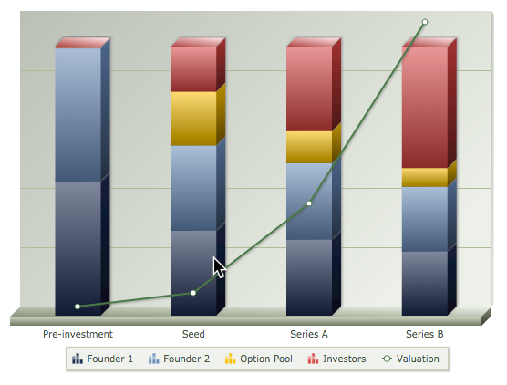

# The Open Guide to Equity Compensation

	
   
  Example of company valuation, shares, fundraising, and dilution (<a href="http://ownyourventure.com/equitySim.html">source</a>)
   

## Table of Contents

- [Introduction](#introduction)
- [About This Guide](#about-this-guide)
- [Companies, Compensation, and Stock](#companies-compensation-and-stock)
- [Equity Compensation Details](#equity-compensation-details)
- [Tax Basics](#tax-basics)
- [Taxes on Stock and Options](#taxes-on-stock-and-options)
- [Taxes on RSUs](#taxes-on-rsus)
- [Stages of a Startup](#stages-of-a-startup)
- [Evaluating Equity Compensation](#evaluating-equity-compensation)
- [Negotiations and Offers](#negotiations-and-offers)
- [Common Scenarios](#common-scenarios)
- [Documents and Agreements](#documents-and-agreements)
- [Compensation Gotchas](#compensation-gotchas)
- [Tax Gotchas](#tax-gotchas)
- [Further Reading](#further-reading)
- [Credits](#credits)
- [Disclaimer](#disclaimer)
- [License](#license)

## Introduction

Growing numbers of people are working in startups and fast-growing tech companies.
If you are one of them, or are considering becoming one, you probably have experienced or
tried to learn about stock and stock options, RSUs, and other types of
[**equity compensation**](http://www.investopedia.com/terms/e/equity-compensation.asp).

### Should You Read This?

Perhaps some of these scenarios are familiar:

- You hear phrases like *stock*, *stock options*, *strike price*, *ISOs*, *RSUs*, *83(b)*,
  *409A*, *AMT*, or *early exercise* and know they are important but are mystified by what
  some of them really mean.
- You’re getting a new job offer but don’t know how to negotiate or think about the equity
  component of the offer.
- You’re joining a startup for the first time, and are terrified by all the paperwork.
- You’re quitting or are being laid off or fired from a company where you have stock or
  options and are thinking through the decisions and consequences.
- A company you work at is going through an acquisition, IPO, or shutdown.
- You have stock in a private company and need cash.
- You’re an entrepreneur or hiring manager negotiating with candidates or fielding questions
  from candidates and employees.

Equity compensation is a confusing topic that is often not discussed clearly.
Many people learn the basic ideas through experience or from friends who have been through
the stages of a startup, but equity compensation is so complicated it is usually only
thoroughly understood by professionals.
Often an employee has far less information about details than the person hiring or
managing them.
On the other hand, founders and hiring managers often don’t have good knowledge of the
technicalities, either!
And when they do, that doesn’t mean they can explain it all clearly.

Sadly, both companies and employees are routinely hurt by uninformed decisions and costly
mistakes which might otherwise be avoided.
Talk to anyone who’s worked in startups and they’ll have stories of how they or their
colleagues have met with the painful consequences of not learning enough up front.
It is critical for everyone to understand both the basics and some very technical details
about the exact type of compensation you have or might have, including the tax
consequences.

Equity compensation and tax might seem like different topics, but they are so intertwined
it’s hard to explain one without the other.
An understanding of the underlying rules is also necessary for negotiating fair offers—on
both sides.

### Why This Guide

This Guide aims to improve the situation.
We presume you are intelligent, but not that you have a law degree or MBA, or that you’ve
previously worked in startups, HR, or financial operations.
The material is dense, but we endeavor to present it in a way that is useful both for
novices and professionals or experts.

This Guide is long enough we suggest you bookmark and refer to it in the future.
An hour or two reading the material here and the linked resources could ultimately be
among the most financially valuable ways you spend your time.

Of course, this Guide can’t replace professional advice.
But assessing the advice you receive from your personal or company attorney can be easier
when you have all the information to work with.

*This document and the discussion around it are not legal or tax advice.*
Talk to a professional if you need advice about your particular situation.
See the full disclaimer [below](#disclaimer).

## About This Guide

### What is covered?

- This Guide applies to [**C corporations**](https://en.wikipedia.org/wiki/C_corporation) in the
  **United States**.
- It’s geared towards employees, advisors, and independent contractors who want to know how
  stock and stock options in C corps work.
  This includes most startups.
  Typically startups and major companies are C corps, and not
  [LLCs](https://en.wikipedia.org/wiki/Limited_liability_company) or
  [S corporations](https://en.wikipedia.org/wiki/S_corporation). LLC equity compensation is
  different and not covered in this Guide (yet).
- This content should also be useful for founders or hiring managers who need to talk about
  equity compensation with employees or potential hires.
- Our aim is to be as helpful to the absolute beginner as it is for those with more
  experience. Anyone curious to learn about these topics will be able to navigate this
  Guide.

### Format

- We keep this brief, so you can skim and return to it easily.
- Sections are organized into individual points, so it’s easier to read, refer back to,
  contribute to, and correct.
- We link liberally, so we can define terms, include curated articles that have a lot more
  detail, and give credit where it is due.

### Legend

- 🔹 Important or often overlooked tip
- ❗ “Serious” gotcha where risks or costs are significant
- 🔸 A gotcha or limitation to be aware of
- 🌪 Controversial topic where informed opinion varies significantly
- ☝️ Common confusion or misunderstanding, such as confusing terminology
- 📥 PDF or form or download

### Why an Open Guide? Why on GitHub?

We call this an “open” Guide since it’s [open to contributions](/CONTRIBUTING.md), so, unlike
a blog, it is living, and can be improved and updated as things change.
While [a lot of information](#further-reading) on this topic is just a Google search away,
the best information is scattered about.
Many blogs and articles focus only on a narrow topic, are getting older, or are on sites
supported by ads or other products.
It should be possible to assemble this information sensibly, for free.
This document was started by [Joshua Levy](https://github.com/jlevy) and
[Joe Wallin](http://joewallin.com/about-joe-wallin/). It no doubt has some errors and
shortcomings, but we want to see it evolve.

### Please contribute!

If you have an idea or contribution that might improve this Guide, please
[**file issues or PRs**](/CONTRIBUTING.md). Questions are also welcome (as issues), as they help
us next time we revise the guide.
We gladly credit all contributors.

## Companies, Compensation, and Stock

### What is compensation?

**Compensation** is everything you get when working for a company.
Some compensation is cash—your salary and bonus, if you get one.
Other parts are benefits, like health insurance, family-related protections, perks, and
retirement plans.
But for many jobs, compensation includes a kind of ownership in a company, called equity.
It’s this last part we focus on.

To understand exactly how compensation works, it helps to start at the beginning:
What is a company, exactly?
What is ownership, exactly?
And what is this ownership worth?

### What is a company?

- Broadly, a **company** is a legal entity formed under corporate law for the purpose of
  conducting trade.
  In the United States,
  [several kinds of business entities](https://en.wikipedia.org/wiki/Types_of_business_entity#United_States)
  may be formed, or [**incorporated**](https://en.wikipedia.org/wiki/Incorporation_(business)),
  under the laws of a specific state.

- Companies involve many people, so it’s important to track how much of the company each
  person owns, so that future profits are divided appropriately.
  Historically, this has been done a few ways, depending on the size and nature of the
  company. One way to do this, especially when a lot of people are involved, is via stock,
  which we’ll get into next.

- Companies in the US include sole proprietorships, partnerships, limited liability
  companies (LLCs), S corporations, and C corporations.
  \- 🔸 This Guide does not cover equity compensation in LLCs, as they are rarely used as the
  choice of entity for technology startups, and equity compensation in LLCs is dramatically
  different from equity compensation in corporations.
  So we’ll focus on the one type of company most readers of this Guide will be concerned
  with: The C corporation.

- A [**C corporation (or C corp)**](https://en.wikipedia.org/wiki/C_corporation) is a type of
  business entity in the United States.
  Specifically, it’s a kind of
  [stock corporation](https://en.wikipedia.org/wiki/Joint-stock_company) with certain federal
  tax treatment.
  Most large companies you’ve heard of, as well as startups that aspire to be large, are C
  corporations. In practice, for a
  [few](https://www.nytimes.com/2012/07/01/business/how-delaware-thrives-as-a-corporate-tax-haven.html)
  [reasons](https://www.quora.com/Why-do-most-technology-startups-incorporate-in-Delaware),
  these companies are usually formed in Delaware, so legalities of all this are defined in
  Delaware law.

### What is stock and what is equity?

- [**Stock**](https://en.wikipedia.org/wiki/Stock) is a legal invention that helps track ownership
  of a company. It allows the company to grant ownership to a variety of people or other
  companies in flexible ways.
  Stock is divided into **shares**, and every owner, or **shareholder**, holds a specific number
  of shares. Typically, founders, investors, employees, board members, contractors,
  advisors, and other companies, like law firms, can all be shareholders.

- Stock ownership is formalized on **stock certificates**, which are fancy pieces of paper
  that show you own the stock.
  Sometimes you have stock but don’t have the physical certificate, as it may be held for
  you at a law office.

- [**Outstanding shares**](http://www.investopedia.com/terms/o/outstandingshares.asp) refer to the
  total number of shares at a given point, reflecting how many shares are currently held by
  all shareholders.
  This number starts at an essentially arbitrary value (such as 10 million) when the company
  is created, and thereafter will increase as new shares are added (issued) and granted to
  people in exchange for money or services.
  Outstanding shares may increase or decrease for other reasons, too (such as stock splits
  and share buyback, which we won’t get into here).
  There is a lot of nuance and complexity in all this, because each part is defined by piles
  and piles of legal documents.

- If you have stock, what ultimately matters is not the number of shares you hold, but the
  **percentage ownership** of the entire company that that number represents.
  To determine the percentage of the company a certain number of shares represents, you
  divide it by the number of outstanding shares.
  Even if you have a fixed number of shares, your percentage ownership will change over time
  as the outstanding shares change.

- Informally, we say you have **equity** in a company when you have some kind of ownership or
  likely future ownership.
  In practice, this can mean, stock, stock options, and RSUs, which we’ll divide and conquer
  later. - 👆 The word “equity” has
  [several technical meanings](https://www.investopedia.com/terms/e/equity.asp) in accounting
  and other financial contexts, but when we talk about equity compensation, it is meant more
  informally.

- **Why give equity compensation?**
  The purpose of equity compensation is twofold:
  - To attract the best talent:
    When a company already has or can be predicted to have significant financial success, the
    most talented people are incentivized to work for the company by the prospect of their
    equity turning into large amounts of cash in the future.
  - To align individuals’ incentives with the interests of the company:
    Even companies that can afford to pay lots of cash may prefer to give employees equity, so
    that employees work to increase the *future* value of the company.
    At its best, this philosophy fosters an environment of teamwork and a “rising tides lift
    all boats” mentality.
    As we’ll talk more about during our chapter on [negotiations](negotiations-and-offers), the
    amount of equity you’re offered usually reflects both your past or current contribution to
    the company and your commitment to the company in the future.

### What is equity worth?

- [**Public companies**](https://en.wikipedia.org/wiki/Public_company) are corporations where any
  member of the public can own stock.
  People can buy and sell the stock for cash on public
  [exchanges](https://www.investopedia.com/terms/e/exchange.asp). The value of a company’s
  shares is the value you see in the stock market reports, so shareholders know how much
  their stock is worth.
- Most smaller companies, including all startups, are
  [**private companies**](https://en.wikipedia.org/wiki/Privately_held_company), where shareholders
  are restricted, meaning you can’t buy and sell stock easily or to anyone at any time.
- ❗️ It’s hard to know precisely the value of private company stock.
  A stock certificate is a piece of paper that entitles you to something of highly uncertain
  value, and could well be worthless in the future, or highly valuable, depending on the
  fate of the company.
  Because the value of private company stock is not determined by public trades,
  shareholders make educated guesses about the likely future value, at a time when they will
  be able to buy or sell the stock.
- Public and some private companies can pay
  [**dividends**](http://www.investopedia.com/terms/d/dividend.asp) to shareholders, but this is not
  common among startups and other companies focused on growth.
- The ability to buy and sell stock is called **liquidity**. In startups and many private
  companies, it is typical to hold the stock until the company is sold or becomes public in
  an [**IPO**](https://en.wikipedia.org/wiki/Initial_public_offering). A sale or IPO is often
  called an **exit** or **liquidity event**. Sales, dissolutions, and bankruptcy are all called
  **liquidations**.
- 🔹 **Private sales:**
  Liquidity events may also *never happen*-if, say, the company stays private or shuts
  down. But lacking the eventuality of a liquidity event, individuals may still buy or sell
  stock (“gain liquidity”) in private companies in specific ways:
  \- In a few cases, you may be able to sell private company stock to another private party,
  such as an accredited investor who wants to become an investor in the company.
  This is called a **secondary market** transaction.
  While many who hold stock hope or expect they need only find a willing buyer, in practice,
  secondary sales only work out in a few situations.
  In some cases, you may have luck selling stock privately to an individual, like a board
  member or former executive who wishes to increase their ownership.
  Quora has
  [more discussion](https://www.quora.com/How-do-employees-in-startups-sell-stock-in-the-secondary-markets)
  on this topic.
  \- Sales generally require the agreement and cooperation of the company, for both
  contractual and practical reasons.
  Typically shares held are subject to a **right of first refusal** in favor of the company,
  meaning someone can’t sell their shares to a third party without offering to sell it to
  the company first.
  \- **Why companies may not support secondary sales:**
  It’s important to consider a company’s perspective on secondary sales as well:
  - Historically, startups have seen little purpose in letting current employees sell their
    stock, since they prefer employees hold their stock and work to make it more valuable (by
    improving the value of the company as a whole).
    \- But former employees and other shareholders often have difficulty initiating secondary
    transactions as well.
    Private buyers may ask for the company’s internal financials in order to estimate the
    current and future value of its stock;
    the company may not wish to share this confidential information.
    Companies
    [also will want to consider](https://www.secondariesinvestor.com/new-normal-secondaries-409a-valuation-process/)
    whether sales could influence their [409A valuation](#409a-valuations). - Last but not
    least, secondary sales are also an administrative and legal burden that may not make it to
    the top of the list of priorities for busy startup CEOs and CFOs.
    \- **Secondary buyers:**
    Thinking on all this
    [has evolved](http://www.industryventures.com/2014/12/02/employee-liquidity-good-for-private-companies/)
    [in recent years](https://techcrunch.com/2015/10/14/selling-private-company-shares-2-0/);
    some companies do see value in offering (mostly limited) opportunities for sale.
    [SharesPost](http://sharespost.com/), [Equidate](https://www.equidateinc.com/), and
    [EquityZen](https://equityzen.com/) have sought to establish a market around secondary sales,
    particularly for well-known pre-IPO companies.
    A few other secondary firms have emerged that have interest in certain purchases,
    especially for larger sales from founders, early employees, or executives (parties
    generally in possession of larger shares).
    A company can work with the firm to facilitate multiple transactions.
    These firms include [137 Ventures](http://137ventures.com/),
    [ESO Fund](https://employeestockoptions.com/),
    [Akkadian Ventures](https://www.akkadianventures.com/),
    [Industry Ventures](http://www.industryventures.com/), [Atlas Peak](http://www.atlaspeakcap.com/),
    and [Founders Circle](http://www.founderscircle.com/).

### How does the value of equity change?

We’ve now seen how complex it is to assess the value of equity in private companies.
It is even more complex than this, because the value is always changing.

- In order to finance a company, companies **fundraise** by selling shares in their business
  to [investors](http://www.investopedia.com/terms/i/investor.asp) in exchange for capital.
  With the focus on rapid growth in startups, fundraising (usually from investors called
  **venture capitalists**) is the most likely path for these companies early on.
  (More on the [stages of startups](#stages-of-a-startup) is below.)
- As these companies add (or “issue”) stock, the outstanding shares goes up, and the
  percentage ownership of each shareholder goes down.
  This is called [**dilution**](http://www.investopedia.com/terms/d/dilution.asp), but don’t let
  that word freak you out.
  - Dilution doesn’t necessarily mean that as a shareholder you’re losing anything-usually, as
    a company raises money and issues stock, the hope and intention is that what you do have
    is worth more.
    The size of your slice gets relatively smaller, but if the company is growing, the size of
    the cake gets bigger.
    \- For example, a typical startup might have three rounds of funding, with each round of
    funding issuing 20% more shares.
    At the end of the three rounds, there are more outstanding shares-roughly 70% more in this
    case, since 120%×120%×120% is 173%-and each shareholder owns proportionally less of the
    company.
- On the other hand, the [**valuation**](https://en.wikipedia.org/wiki/Valuation_(finance)) of the
  company, which is the present value investors believe the company has, can change over
  time as well. If the company is doing well, making more revenue or gaining users
  (indicating future revenue), the company’s valuation will usually be going up.
- Shareholders often speculate on the valuation of their own shares, even if a sale isn’t
  always possible.
  There are a few ways people do this, though it’s never exact or simple with private
  companies-you can’t just look at the stock market value of a company share.
  For a public company, you can estimate the value of your shares by multiplying the company
  valuation times the percentage ownership.
  This number can go up or down.
  If a company is doing well, its valuation will go up faster than the total shares, so that
  the expected value of your shares will keep going up.
- ❗️ Of course, things do not always go well, and valuation of a company does not always go
  up. If the valuation by investors of a company goes down, then the value of everyone’s
  shares goes down.
  When investors expect a company to do better than it actually does, it can have a lot of
  disappointing consequences for shareholders.
  The implications of this are complicated, and we’ll get into them further.
  But it can happen that a company fails and everyone’s shares become worthless, or that
  certain kinds of shares become worthless while other kinds have some value.

### Counting shares

Now we understand the basic concepts, we get into a few more important details.

☝️🔹 There are important subtleties in how outstanding shares are counted:

- Private companies always have what are referred to as **authorized but unissued** shares.
  For example, a corporation might have 100 million *authorized* shares, but will only have
  *issued* 10 million shares.
  In this example, the corporation would have 90 million *authorized but unissued* shares.
  When you are trying to determine what percentage a number of shares represents, you do
  *not* make reference to the authorized but unissued shares.
- You actually want to know the total issued, but even this number can be confusing, as it
  can be computed
  [more than one way](http://www.mattbartus.com/option-grants-fully-diluted-or-issued-and-outstanding/).
  Typically, people count shares in two ways:
  “issued and outstanding” and “fully diluted.”
- **Issued and outstanding** refers to the number of shares actually issued by the company to
  shareholders, and does not include shares that others may have an option to purchase.
- **Fully diluted** refers to all of the shares that have been issued, all of the shares that
  have been set aside in a stock incentive plan, and all of the shares that could be issued
  if all convertible securities (such as outstanding warrants) were exercised.
  A key difference is that this total will include all the shares in the employee option
  pool that are reserved but not yet issued to employees.
  (The option pool is discussed more below.)
- If you’re trying to figure out the likely percentage a number of shares will be worth in
  the future, it’s best to know the number of shares that are fully diluted.
- 🔸 The terminology mentioned here isn’t universally applied.
  It’s worth discussing these terms with your company to be sure you’re on the same page.

### Classes of stock

Stock comes with various legal rights.
Often investors ask for rights to be paid back first in exchange for their investment.
The way these different rights are handled is by creating different
[classes of shares](https://www.investopedia.com/terms/c/class.asp).

- Two important kinds of stock to be aware of are
  [**common stock**](https://en.wikipedia.org/wiki/Common_stock) and
  [**preferred stock**](https://en.wikipedia.org/wiki/Preferred_stock). This can all vary from
  company to company, but it’s safe to understand *preferred* stock as stock that has
  rights, preferences, and privileges that *common* stock does not have.
  The differences and specific privileges can also vary at
  [each round of funding](#stages-of-a-startup).
- Investors generally get preferred stock, and founders and employees get common stock (or
  an *option* to buy stock, which we’ll get to in a minute).
  \- ☝️ You’ll also hear the term
  [**founders’ stock**](http://www.alleywatch.com/2013/08/what-is-founders-stock-legally/), which is
  ([usually](http://lsvp.com/2008/09/15/what-entrepreneurs-need-to-know-about-founders-stock/))
  common stock allocated at a company’s formation.
- Preferred stock usually has a
  [**liquidation preference**](http://www.investopedia.com/terms/l/liquidation-preference.asp),
  meaning the preferred stock owner will be paid before the common stock owners upon
  liquidation. -
  [**Liquidation overhang**](https://equityzen.com/blog/startup-valuations-and-liquidation-preference-overhang/)
  can occur when the value of a company just doesn’t reach the number of dollars investors
  put into it. Because of liquidation preference, those holding preferred stock (investors)
  will have to be paid before those holding common stock (employees).
  If investors invested a hundred million dollars in your company, your equity as an
  employee won’t be worth anything if the company is sold when it’s in liquidation overhang
  and the sale doesn’t
  [exceed that amount](https://avc.com/2010/10/employee-equity-the-liquidation-overhang/). - ☝️
  Preferences are
  [notoriously](https://venturebeat.com/2010/08/16/beware-the-trappings-of-liquidation-preference/)

  [complex](https://medium.com/@CharlesYu/the-ultimate-guide-to-liquidation-preferences-478dda9f9332).
  Investors and entrepreneurs negotiate a lot of these details, including:
  \- The **multiple**, a number designating how many times the investor must be paid back
  before common shareholders receive proceeds (often the multiple is 1X, but it can be 2X or
  higher). - Whether preferred stock is
  [**participating**](https://en.wikipedia.org/wiki/Participating_preferred_stock), meaning
  investors get their money back and also participate in proceeds from common stock.
  \- Whether there is a **cap**, which limits the payout if it is participating.
- **Does all this matter to you?**
  For the purposes of someone like an employee who holds common stock, it is important to
  know that investors get paid back first on exits.
  Depending on how favorable the terms are for the investor, if the company exits at a low
  or modest valuation, it’s far more likely that common shareholders will not receive
  anything. If a company exits at a very high valuation relative to what was expected,
  liquidation preferences are not going to matter;
  in that case, everyone will own valuable stock.

## Equity Compensation Details

In this section we’ll lay out the differences, benefits, and drawbacks of common types of
granted equity.
We explain stock options and restricted stock units (RSUs), which the most common forms of
equity compensation.
RSUs are more common for larger companies and options more common for startups.

### Stock options

[**Stock options**](https://en.wikipedia.org/wiki/Employee_stock_option) (“employee stock
options,” in this case) are contracts that allow you to buy shares in the company you work
for. When you buy shares, you are **exercising** the options.
Options are not the same as stock;
they are only the right to buy stock upon and subject to the conditions specified in the
option agreement.

Stock options allow you to buy shares at a *fixed* price per share, the **strike price**.
The strike price is generally set lower (often much lower) than what people expect will be
the future value of the stock, which means you can make money when you sell the stock.

Sounds great, right?
But wait just a minute.
Let’s get into some of those conditions and limitations on your option agreement we
mentioned above:

- 🔸 **Vesting**: One of the most significant conditions is that you usually “earn” rights to
  the shares or options over time or under certain events.
  This is called **vesting**.
  - Vesting usually occurs according to a **vesting schedule**. You vest only while you work for
    the company. For example, it is very common to have stock or options vest over a period of
    four years, a bit at a time, where none of it is vested at first, and all of it is vested
    after four years.
  - Vesting schedules can also have a **cliff**, where until you work for a given amount of
    time, you are 0% vested.
    For example, if your equity award had a one-year cliff and you only worked for the company
    for 11 months, you would not get anything, since you have not vested in any part of your
    award. Similarly, if the company is sold within a year, depending on what your paperwork
    says, you may also receive nothing on the sale of the company.
  - A very common vesting schedule is vesting over 4 years, with a 1 year cliff.
    This means you get 0% vesting for the first 12 months, 25% vesting at the 12th month, and
    1/48th (2.08%) more vesting each month until the 48th month.
    For example, if you leave just before a year is up, you get nothing, but if you leave
    after 3 years, you get 75%.
  - Vesting *can* be triggered outside of these timelines.
    You may have [**acceleration**](http://www.danshapiro.com/blog/2012/04/vesting-is-a-hack/), where
    vesting is triggered if a company is sold (**single trigger**) or if it’s sold and you’re
    fired (**double trigger**). This is common for founders and not so common for employees.
- **Options expire**: You need to know how long the **exercise window** (the time during which
  you can buy shares at the strike price) will be open.
  \- Options are only exercisable for a fixed period of time, typically seven to ten years as
  long as you are working for the company.
  \- ❗ Importantly, options can expire after you quit working for the company.
  Often, the expiration is **90 days** after termination of service, making the options
  effectively worthless if you cannot exercise before that point.
  \- 🔹 Recently (since around 2015) a few companies are finding ways to keep the exercise
  window open for years after leaving a company, promoting this practice as fairer to
  employees. See [this list](https://github.com/holman/extended-exercise-windows), which
  includes
  [Amplitude](https://amplitude.com/blog/2015/12/01/employee-equity-is-broken-heres-our-fix/),
  [Clef](https://github.com/clef/handbook/blob/master/Hiring%20Documents/Guide%20to%20Your%20Equity.md),
  [Coinbase](https://medium.com/@barmstrong/improving-equity-compensation-at-coinbase-8749979409c3),
  [Pinterest](http://fortune.com/2015/03/23/pinterest-employee-taxes/), and
  [Quora](https://www.quora.com/Why-do-most-startups-force-employees-to-exercise-their-vested-ISO-options-within-90-days-if-they-leave-rather-than-the-option-to-convert-to-NSOs).
- **A note on advisors**: Options granted to advisors typically vest over a shorter period than
  employee grants, often two years.
  Advisor grants also typically have a longer exercise window post termination of service.
  Typical terms for advisors, including equity levels, are available from the 📥 Founder
  Institute’s [Founder/Advisor Standard Template (FAST)](https://fi.co/contents/fast#).

### RSUs

- [**Restricted stock units (RSUs)**](http://www.investopedia.com/terms/r/restricted-stock-unit.asp)
  refer to an agreement by the company to issue you shares of stock or the cash value of
  shares of stock on a future date.
  Each unit represents one share of stock or the cash value of one share of stock that you
  will receive in the future.
  The date on which you receive the shares or cash payment is the **settlement date**.
- 🔸 RSUs may vest according to a vesting schedule.
  The settlement date may be the time-based vesting date or a later date based on, for
  instance, the date of a company’s IPO.
- RSUs are difficult in a startup or early stage company because when the RSUs vest, the
  value of the shares might be significant, and taxes will be owed on the receipt of the
  shares. This is not a bad result when the company has sufficient capital to help the
  employee make the tax payments, or the company is a public company that has put in place a
  program for selling shares to pay the taxes.
  But for cash-strapped private startups, neither of these are possibilities.
  This is the reason most startups use stock options rather than RSUs, stock bonuses, or
  stock awards.
- RSUs are often considered less preferable to grantees since they remove control over when
  you owe tax. Options, if granted with an exercise price equal to the fair market value of
  the stock, are not taxed until exercise, an event under the control of the optionee.
  If a company awards you an RSU or restricted stock award which vests over time, you will
  be taxed on the vesting schedule.
  You have been put on “autopilot” with respect to the timing of the tax event.
  This can be a really bad thing if, on the date of vesting, the shares are worth a lot and
  consequently you owe a lot of tax.
- ☝️ **You don’t want to confuse “restricted stock units” with “restricted stock,”** an
  entirely different thing (described soon).

### Less common types of equity

- **Phantom equity** is a type of compensation award that references equity, but does not
  entitle the recipient to actual equity in the business.
  These awards come under a variety of different monikers, but the key to understanding them
  is knowing that they are really just cash bonus plans, where the cash amounts are
  determined by reference to a company’s stock.
  Phantom equity can have significant value, but may be perceived as less valuable by
  workers because of the contractual nature of the promises.
  Phantom equity plans can be set up as purely discretionary bonus plans, which is less
  attractive than owning a piece of something.
  Two examples of phantom equity are phantom stock and stock appreciation rights:
  \- A
  [**phantom stock**](http://www.investopedia.com/articles/stocks/12/introduction-phantom-stock.asp)
  award entitles you to a payment equal to the value of a share of the company’s stock,
  upon the occurrence of certain events.
  \-
  [**Stock appreciation rights (SAR)**](https://www.nceo.org/articles/phantom-stock-appreciation-rights-sars)
  give the recipient the right to receive a payment calculated by reference to the
  appreciation in the equity of the company.
- [**Warrants**](https://en.wikipedia.org/wiki/Warrant_%28finance%29) are another kind of option to
  purchase stock, generally used in investment transactions (for example, in a convertible
  note offering, investors may also get a warrant;
  or a law firm may ask for one in exchange for vendor financing).
  As an employee or advisor, you may not encounter warrants, but it’s worth knowing they
  exist. They differ from stock options in that they are more abbreviated and stand-alone
  legal documents, not granted pursuant to a “plan.”
  Also, because they are usually used in the investment context, they do not typically
  include service-based vesting provisions or termination at end of service, and are valid
  for a set number of years (often, 10 years).

### How equity compensation is granted

Now for the details around how stock and options are used for compensation.

- Companies can give equity compensation as stock awards, stock options, or RSUs.
  While the intent of each is similar, they
  [differ in many ways](http://joewallin.com/2014/09/13/rsus-vs-restricted-stock-vs-stock-options/),
  particularly around taxation.
  RSUs generally don’t make sense for early stage companies.
- If companies do grant stock, it may be **restricted stock**. In this context, “restricted”
  refers to the fact that the stock will be subject to repurchase at a lower rate than fair
  market value or cost, and the repurchase right lapses over the service-based vesting
  period.
- Typically, stock awards are limited to executives or very early hires, since once the
  value of the shares increases, the tax burden of receiving them can be too great for most
  people. Instead, it’s more common for employees to get stock options.
- 🔹 At some point early on, generally before the first employees are hired, stock will be
  allocated to a stock [**option pool**](http://www.investopedia.com/terms/o/option-pool.asp). A
  typical size for this is 20% of the stock of the company, but it can be 10%, 15%, or other
  sizes. Once the pool is established, then the company’s board of directors grants pieces
  of it to employees as they join the company.
  Often, the whole pool is never used.
  The size of the pool is not just about how generous the company is with employees;
  it is determined by
  [complex factors between founders and investors](http://venturehacks.com/articles/option-pool-shuffle).
- 🔹☝️ Compensatory stock options come in two flavors, **incentive stock options (or ISOs)**
  and **non-qualifying stock options (or NQOs)**. Confusingly, lawyers can’t even agree on
  the names of these two kinds of stock options, so you’ll also see them called **statutory
  stock options** and **non-statutory stock options (or NSOs)**, respectively.
  \- ISOs are common for employees because they have the possibility of being more favorable
  from a tax point of view than NSOs (below).
  They can only be granted to employees (not independent contractors or directors who are
  not also employees).
  But ISOs have a number of limitations and conditions and can also create difficult tax
  consequences. More on this below.
- 🔹 Sometimes, to help you lower your tax burden, the company makes it possible to **early
  exercise (or forward exercise)** stock options.
  This means you exercise them even before they vest, which means you become a stockholder.
  However, the company has the right to repurchase the *unvested* shares, at a lower price
  than what you paid, or the fair market value of the shares, if you quit working for the
  company. The company will typically repurchase the unvested shares should you leave the
  company before the stock you’ve purchased vests.
- 🔸 Stock options will expire after you leave a company (typically after **90 days**). You
  might early exercise, or exercise at different times during your employment, depending on
  how much it costs and what the tax implications are.
  More on this below.
- Companies may impose additional restrictions on stock that is vested.
  For example, your shares are very likely subject to a right of first refusal.
  And it can happen that companies reserve the right to repurchase vested shares in certain
  events.

## Tax Basics

Equity compensation awards can give rise to federal and state income taxes as well as
employment taxes and Medicare surtax charges.
We’ll first back up and discuss fundamentals of how different kinds of taxes are
calculated.

- You must pay federal, state, and in some cases, local taxes on income.
- State tax rates and rules
  [vary significantly state to state](http://taxfoundation.org/article/state-individual-income-tax-rates-and-brackets-2015).
  Since federal rates are much higher than state rates, you usually think of federal tax
  planning first.
- 🔹 In general, federal tax applies to
  [many kinds of income](https://www.irs.gov/taxtopics/tc400.html). If you’re an employee at a
  startup, you need to consider four kinds of federal tax, each of which is computed
  differently:
  - **Ordinary income tax**: The tax on your wages or salary income, as well as investment income
    that is “short-term.”
  - **Employment taxes**: Social Security and Medicare taxes that are withheld from your
    paycheck. The Social Security wage withholding rate is 6.2% up to the FICA wage base.
    The Hospital Insurance component is 1.45%, and it does not phase out above the FICA wage
    base.
  - **Long-term capital gains tax**: Taxes on investment gains that are “long-term” are taxed at
    a lower rate than ordinary income.
  - **Alternative Minimum Tax (AMT)**: An
    [entirely different kind of tax](https://en.wikipedia.org/wiki/Alternative_minimum_tax) that
    has separate rules and only applies in some situations.
- Ordinary income tax applies in the situations you’re probably already familiar with, where
  you pay taxes on [salaries or wages](https://www.irs.gov/taxtopics/tc401.html). Tax rates are
  based on
  [filing status](https://www.irs.gov/uac/Newsroom/Determining-Your-Correct-Filing-Status) (if
  you are single, married, or support a family), and on which
  [**income bracket**](http://taxfoundation.org/article/2015-tax-brackets) you fall under.
- As of the 2018 tax year, there are income brackets at **10%**, **12%**, **22%**, **24%**, **32%**,
  **35%**, and **37%** [marginal tax rates](http://www.investopedia.com/terms/m/marginaltaxrate.asp)—see
  [Notice 1036](https://www.irs.gov/pub/irs-pdf/n1036.pdf). Be sure you understand how these
  brackets work, and what bracket you’re likely to be in.
  \- ☝️ There is sometimes a
  [misconception](https://today.yougov.com/news/2013/01/08/understanding-how-marginal-taxes-work-its-all-part/)
  that if you move to a higher bracket, you’ll make less money.
  What actually happens is when you cross certain thresholds, each additional (marginal)
  dollar money you make is taxed at a higher rate, equal to the bracket you’re in.
  It looks roughly [like this](http://i.imgur.com/uLaJJ5q.png) ([source](https://www.reddit.com/r/personalfinance/comments/2wkbgz/graphing_one_misconception_about_tax_brackets/)).
- Investment gains, such as buying and selling a stock, are similarly taxed at “ordinary”
  rates, unless they are [**long-term**](https://www.irs.gov/taxtopics/tc409.html), which means you
  held the asset for more than a year.
- 📥 You also pay a number of other federal taxes (see a
  [2015 summary for all states](http://www.adp.com/~/media/Compliance/2015%20Fast%20Wage%20and%20Tax%20Facts/2015FastFactsALL.ashx)),
  notably:
  - **6.2%** for Social Security on your first $118,500
  - **1.45%** for Medicare
  - **0.9%**
    [Additional Medicare Tax](https://www.irs.gov/Businesses/Small-Businesses-&-Self-Employed/Questions-and-Answers-for-the-Additional-Medicare-Tax)
    on income over $200,000 (single) or $250,000 (married filing jointly)
  - **3.8%**
    [Net Investment Income Tax](https://www.irs.gov/uac/Newsroom/Net-Investment-Income-Tax-FAQs)
    on investment income if you make over $200,000 (single) or $250,000 (married filing
    jointly)
- Ordinary federal income tax, Social Security, and Medicare taxes are withheld from your
  paycheck by your employer and are called
  [**employment taxes**](https://www.irs.gov/Businesses/Small-Businesses-&-Self-Employed/Understanding-Employment-Taxes).
- 🔹 Long-term capital gains are
  [taxed at a lower rate](http://www.fool.com/retirement/general/2015/12/14/long-term-capital-gains-tax-rates-in-2016.aspx)
  than ordinary income tax: **0%**, **15%**, or **20%**. This covers cases where you get
  dividends or sell stock after holding it a year.
  If you are in the middle brackets (more than about $37K and less than $413K of ordinary
  income), your long-term capital gains rate is 15% ([more details](http://taxes.about.com/od/Federal-Income-Taxes/fl/Federal-Income-Tax-Rates-for-the-Year-2015.htm)).
- State long-term capital gains rates
  [vary widely](http://www.fool.com/personal-finance/taxes/2014/10/04/the-states-with-the-highest-capital-gains-tax-rate.aspx).
  California has the highest, at 13.3%, while other states have none.
  For this reason, some people even consider moving to another state if they are likely to
  have a windfall gain, like selling a lot of stock after an IPO.
- [Alternative Minimum Tax (AMT)](http://fairmark.com/general-taxation/alternative-minimum-tax/alternative-minimum-tax-101/)
  is a [complex part](https://www.irs.gov/taxtopics/tc556.html) of the federal tax code many
  taxpayers never worry about.
  Generally, you do not pay
  [unless you have high income (>$250K) or high deductions](http://www.marketwatch.com/story/congratulations-you-owe-the-alternative-minimum-tax-2014-01-14).
  It also depends on where you file, since your state taxes can significantly affect your
  deductions. Confusingly, if you are affected, AMT tax rates are usually at **26%** or **28%**
  marginal tax rate, but effectively is **35%** for some ranges, meaning it is
  [higher than ordinary income tax for some incomes and lower for others](http://www.forbes.com/sites/feeonlyplanner/2011/12/16/the-alternative-minimum-tax-sweet-spot/).
  AMT rules are so complicated you often need professional tax help if they might apply to
  you. The IRS’s
  [AMT Assistant](https://www.irs.gov/Businesses/Small-Businesses-&-Self-Employed/Alternative-Minimum-Tax-(AMT)-Assistant-for-Individuals)
  might also help.
- ❗ AMT is important to understand because exercising incentive stock options can trigger
  AMT. In some cases a *lot* of AMT, *even when you haven’t sold the stock* and have no
  money to pay. More on this below.
- 🔹 Section 1202 of the Internal Revenue Code provides a special tax break for qualified
  small business stock held for more than five years.
  Currently, this tax break is a 100% exclusion from income for up to $10M in gain.
  There are also special rules that enable you to rollover gain on qualified small business
  stock you have held for less than five years.
  Stock received on the exercise of options can qualify for the Section 1202 stock benefit.

## Taxes on Stock and Options

Now we’ve covered the basic concepts of equity and taxes, here are some messy details of
how they interact.

As already discussed, employees can get restricted stock, stock options, or RSUs.
The tax consequences for each of these is dramatically different.

### 83(b) elections

- Generally, restricted stock is taxed as ordinary income
  *[when it vests](http://www.investopedia.com/articles/tax/09/restricted-stock-tax.asp?performancelayout=true).*
  If the stock is in a startup with low value, this may not result in a high tax.
  If it’s been years since the stock was first granted and the company is now worth a lot,
  the taxes owed could be quite significant.
- 🔹 The Internal Revenue Code offers an alternative that will protect you from this high
  potential tax.
  It’s called a
  [**Section 83(b) election**](http://acceleratedvesting.com/what-is-an-83b-election-and-when-do-i-make-it-part-1-with-graphic/),
  and ensures that you’ll be taxed on the receipt of the “property” (the stock), rather than
  at the time the stock vests.
  Basically, with a Section 83(b) election, you’re telling the IRS you want to pay taxes
  early, and this can potentially reduce your tax significantly:
  If the shares go up in value, the taxes owed on vesting might be far greater than the
  taxes owed at the time of receipt.
  - An 83(b) election isn’t guaranteed to reduce your taxes, of course.
    For example, the value of the stock may not increase.
    And if you leave the company before you vest, you *don’t* get the taxes you’ve paid back.
  - ❗ You must file the 83(b) election yourself with the IRS
    [**within 30 days**](https://www.irs.gov/irb/2012-28_IRB/ar12.html) of the grant or exercise, or
    the opportunity is irrevocably lost.
  - 🔸 Section 83(b) elections cannot be made on the receipt of a stock option.
    They can only be made on the receipt of actual shares of stock.
  - If you receive an early exercisable stock option (when you don’t have to wait for the the
    stock to vest), you can make an 83(b) election on receipt of the shares on exercise.
  - Section 83(b) elections do not apply to vested shares;
    the election only applies to stock that is not yet vested.
    Thus, if you receive options that are *not* early exercisable (meaning you have to wait
    until they vest to exercise), an 83(b) election would not apply.
  - 🔹 Founders and very early employees will almost always want to do an 83(b) election upon
    the receipt of unvested shares, since the stock value is probably low.
    If the value is really low, and the taxes owed are not that great, you can make the
    election without having to pay much tax and start your capital gains holding period on the
    shares.

### 409A valuations

- When stock vests, or you exercise an option, the IRS will consider what the **fair market
  value (FMV)** of the stock is when determining the tax you owe.
- Of course, if no one is buying and selling stock, as is the case in most startups, then
  its value isn’t obvious.
  For the IRS to evaluate how much stock is worth, it uses what is known as the
  [**409A valuation**](http://www.fenwick.com/FenwickDocuments/409_Valuations_Stock_Options.pdf) of
  the company.
  - The startup pays for an appraisal that sets the 409A, typically annually or after events
    like fundraising.
  - 🔹 A company wants the 409A to be low, so that employees make more off options, but not
    low enough the IRS won’t consider it reasonable.
    Typically, the 409A is much less than what investors pay for preferred stock;
    often, it might be only a third of the preferred stock price.

### Stock awards vs ISOs vs NSOs

- Startups generally decide to give ISOs or NSOs depending on the legal advice they get.
  It’s rarely up to you which you get, so you need to know about both.
  There are pros and cons of each from both the recipient’s and the company’s perspective.
  - 🔸 ISOs cannot be granted to non-employees (like independent contractors).
- ❗🔹 **When you owe tax**: When you get stock options and are considering if and when to
  exercise them, you need to think about the taxes.
  In principle, you need to think about taxes (1) at time of grant;
  (2) at time of exercise;
  and (3) at time of sale.
- These events trigger ordinary tax (high), long-term capital gains (low), or AMT (possibly
  high) taxes in different ways for NSOs and ISOs.
  The taxes will depend on the gain (sometimes called spread) between the strike price and
  the FMV, known as the
  [**bargain element**](http://www.investorwords.com/5414/bargain_element.html), and the gain on the
  sale. This isn’t the whole story, but from an employee’s point of view, the key
  differences are (see [here](https://www.irs.gov/taxtopics/tc427.html),
  [here](http://www.startuplawblog.com/2013/05/15/incentive-stock-options-vs-nonqualified-stock-options/),
  [here](http://www.investopedia.com/articles/optioninvestor/07/esoabout.asp), and
  [here](http://www.startuplawblog.com/2010/08/11/top-reasons-nqos-over-isos/)):
  - **Restricted stock awards**: Assuming vesting, you pay full taxes early with the 83(b) or at
    vesting:
    - At grant:
      - If 83(b) election filed, ordinary tax on FMV
      - None otherwise
    - At vesting:
      - None if 83(b) election filed
      - Ordinary tax on FMV of vested portion otherwise
    - At sale:
      - Long-term capital gains tax on gain if held for *1 year past exercise*
      - Ordinary tax otherwise (including immediate sale)
  - **NSOs**: You pay full taxes at exercise, and the sale is like any investment gain:
    - At grant and vesting:
      - No tax if granted at FMV
    - At exercise:
      - Ordinary tax on the bargain element
      - Income and employment tax withholding on paycheck
    - At sale:
      - Long-term capital gains tax on gain if held for *1 year past exercise*
      - Ordinary tax otherwise (including immediate sale)
  - **ISOs**: You might pay less tax at exercise, but it’s complicated:
    - At grant and vesting:
      - No tax if granted at FMV
    - At exercise:
      - AMT tax event on the bargain element;
        no ordinary or capital gains tax
      - No income or employment tax withholding on paycheck
    - At sale:
      - Long-term capital gains if held for *1 year past exercise and 2 years past grant date*
      - Ordinary tax otherwise (including immediate sale)
- ❗ **The AMT trap**: If you have received an ISO, exercising it may unexpectedly trigger a
  big AMT bill—even before you actually make any money on a sale!
  To make matters worse, you probably can’t sell the stock to pay the tax bill.
  This
  [infamous problem](https://medium.com/@barryjk/the-tax-law-that-is-unintentionally-hammering-silicon-valley-employees-894a7b54ba8a)
  ([more details](https://www.nceo.org/articles/stock-options-alternative-minimum-tax-amt))
  has trapped many employees and
  [bankrupted people](http://blog.sfgate.com/dgreenberg/2012/06/22/tax-advice-from-the-dot-com-bubble-beware-of-isos/)
  during past dot-com busts.
  Now more people know about it, but it’s still a significant obstacle to plan around.
  (Note that if your AMT is for events prior to 2008,
  [you’re off the hook](http://www.startuplawblog.com/2009/04/03/whoops-i-didnt-pay-amt-on-my-isos-exercised-prior-to-1108-what-do-i-do/).)
- 🔹 If you are granted ISOs or NSOs at a low strike price, and the bargain element is zero,
  then you may be able to exercise at a reasonable price without triggering taxes at all.
  So assuming the company allows it, it makes sense to early exercise immediately (buying
  most or all of the shares, even though they’re not vested yet) and simultaneously file an
  83(b) election.
- 🔸☝️ Section 83(b) elections are elections to be taxed on the receipt of property even
  though you might have to forfeit or give back the property to the company.
  You can make an election on the receipt of stock, but you cannot make the election on the
  receipt of an option or an RSU because options and RSUs are not considered property for
  purposes of Section 83(b).
- 🔸🌪 ISOs are often preferred by startups, as they’re supposedly better for employees from
  a tax perspective.
  This assumes that (1) AMT won’t be triggered and (2) you’ll get low long-term capital
  gains rate by holding the stock for the appropriate holding periods.
  However, often you either run afoul of the AMT trap, or don’t hold the stock long enough
  with the complicated 1 year + 2 year requirement, or the spread at exercise is small or
  zero, so the difference wouldn’t matter anyway.
  NSOs do have a slightly higher tax because of the employment taxes.
  Overall, it’s not clear the ISO is that much better for employees, so
  [many](http://www.startuplawblog.com/2010/08/11/top-reasons-nqos-over-isos/)
  [people](http://www.business2community.com/finance/nsos-better-isos-0826167#fz1HTCiOQxRyTr62.97)
  argue for NSOs instead.
- 🔸☝️ Even more confusingly, ISOs
  [can make it harder](http://thestartuplawblog.com/the-problem-with-immediately-exercisable-isos/)
  to meet the long-term capital gains holding period.
  Many people expect early exercise together with an 83(b) election will help them hold the
  stock longer, to qualify for long-term capital gains.
  While this is true for NSOs, there is a murky part of the rules on ISOs that implies that
  even with an 83(b) election, the capital gains holding period does not begin until the
  shares actually vest.
  So, if you want to immediately exercise an option and file a Section 83(b) election, and
  you might have liquidity soon, it’s better if you can have it be an NSO.

## Taxes on RSUs

- If you are awarded RSUs, each unit represents one share of stock that you will be given
  when the units vest.
- 🔸 When you receive your shares, you are taxed on their value
  [at that time](http://joewallin.com/2014/09/13/rsus-vs-restricted-stock-vs-stock-options/). If
  you are an employee, this means you may have to write a check to the company to cover your
  income and employment tax withholding.
  Often, for U.S. employees, companies
  [will withhold the tax in the form of shares](https://www.schwab.com/public/eac/resources/articles/rsu_basics.html)
  such that no action is required by the employee at vesting time.
- If you receive an RSU when the stock is of little value, you cannot elect to be taxed on
  the value of that stock when you receive the RSU—you pay taxes at vesting time, based on
  the value of the shares at that time.
- 🔸 There is a combination of big problems for RSUs in private companies:
  - You will owe tax when you receive the shares, even though they are illiquid.
  - You can’t minimize the impact of an increase in value of the underlying shares between the
    date you receive the RSU and the date it is settled.
  - If you are an employee you will have to write a check to the company to satisfy your
    income and employment tax withholding.
- 🔸 RSUs are less attractive than options from a tax point of view because you cannot make
  an 83(b) election with respect to an RSU. By contrast, if you receive a stock option, as
  long as it is priced at fair market value, you will have no income upon receipt of the
  options, and your income tax and employment tax consequences will be deferred until you
  exercise, an event under your control for the most part.
- Taxation summary (compare with above):
  - At grant:
    - No tax
  - At vesting/delivery:
    - Ordinary tax on current share value
  - At sale:
    - Long-term capital gains tax on gain if held for *1 year past exercise*
    - Ordinary tax otherwise (including immediate sale)

## Stages of a Startup

This section is a primer on how companies raise funding and grow, as this is critical to
understanding the value of a company and what equity in a company is worth.

- The stage of a startup is largely reflected in how much funding it has raised.
  Very roughly,
  [typical levels](http://blog.eladgil.com/2011/03/how-funding-rounds-differ-seed-series.html)
  are:
  - **Bootstrapped**: No funding.
    Founders are figuring out what to build, or they’re starting to build with their own time
    and resources.
  - **Series Seed** ($250K to $2 million): Figuring out the product and market.
  - **Series A** ($2 to $15 million): Scaling the product and making the business model work.
  - **Series B** (tens of millions): Scaling the business.
  - **Series C, D, E,** etc.
    (tens to hundreds of millions): Continued scaling of the business.
- 🔸 Most startups don’t get far.
  Very roughly, if you
  [look at angel investments](http://codingvc.com/valuing-employee-options/), **more than half**
  of investments fail, **one in 3** are small successes (1X to 5X returns), **one in 8** are
  big successes (5X to 30x), and **one in 20** are huge successes (30X+).
- 🔸 Each stage reflects the removal of risk and increased dilution.
  For this reason, the equity team members get is higher in the earlier stages (starting
  with founders) and increasingly lower as a company matures.
  (See the picture above.)
- 🔹 It is critical to understand risk and dilution to know the possible future value of
  equity. [This article](http://codingvc.com/valuing-employee-options/) from Leo Polovets, a
  partner at Susa Ventures, gives a good overview.
- 🔹 If you’re talking with a startup, there are a lot of questions to ask in order to
  assess the state of the company’s business.
  Startups are understandably careful about sharing financial information, so you may not
  get full answers to all of these, but you should at least ask:
  - *How much money has the company raised (including in how many rounds, and when)?*
  - *What did the last round value the company at?*
  - *Will the company likely raise more capital soon?*
  - *How long will the company’s current funding last?*
    (This will likely be given at the current burn rate, or how quickly a company is spending
    its funding, so will likely not include calculations for new hires.)
  - *What is the hiring plan?*
    (How many people over what time frame?)
  - *What is the revenue now, if any?
    What are the revenue goals/projections?*
  - *Where do you see this company in 1 year and 5 years, in terms of revenue, number of
    employees, and market position?*

## Evaluating Equity Compensation

It takes quite a bit of know-how to be able to discuss, understand, and evaluate equity
compensation offers.
If you don’t yet have an offer, see the sections below on evaluating a company and
negotiation.

- We all know the value of cash.
  But determining the value of equity is hard, because you have to figure out (or, often,
  make educated guesses) about several things:
  - *Stock value*: Determined by the value the company will have in the future, and the number
    of shares you own.
  - *Vesting and liquidity*: When you will actually receive the shares and when you’ll be able
    to sell them.
  - *Tax*: Both the purchase and the sale of stock can require that you pay taxes—sometimes
    very large amounts.
    There are several kinds of taxes that apply when you have stock:
    income, capital gains, and AMT.
- 🔹 *Percentage*: Knowing how many shares of stock or stock options you have is meaningless
  unless you know the number of outstanding shares.
  What matters is the **percentage** of the company the shares represent.
  Typically, this number is presented in percent or basis points (hundredths of a percent).
  Some companies don’t volunteer this information unless you specifically ask, but it’s
  always a fair question, since without it, the offer of shares is almost meaningless.
- You need to understand the type of stock grant or stock option in detail, and what it
  means for your taxes, to know the likely value.
- In some cases, high taxes may prevent you from exercising your options, and if you can’t
  sell the stock, you could effectively be forced to walk away from it if you can’t afford
  to exercise.
- ❗ If you do get an offer, you need to understand the value of the equity component.
  You need quite a bit of information to figure this out, and should just ask.
  If the company trusts you enough to be giving you an offer, and still doesn’t want to
  answer these questions about your offer, it’s **a warning sign**. (There are many
  [resources](https://blog.wealthfront.com/stock-options-14-crucial-questions/) out there with
  more details about
  [questions](http://www.inc.com/atish-davda/5-questions-you-should-ask-before-taking-a-start-up-job-offer.html)
  like this.)
- 🔹 Information that will help you weigh the offer might be:
  - *What percentage of the company do the shares represent?*
  - *What set of shares was used to compute that percentage (is this really the percentage of
    all shares, or some subset)?*
  - *What did the last round value the company at?
    (I.e. the preferred share price times the total outstanding shares)?*
  - *What is the most recent 409A valuation?
    When was it done, and will it be done again soon?*
  - *Do you allow early exercise of my options?*
  - *Are all employees on the same vesting schedule?*
  - *Is there any acceleration of my vesting if the company is acquired?*
  - *Do you have a policy regarding follow-on stock grants?*
  - *Does the company have any repurchase right to vested shares?*
- Finally, consider the [common scenarios](#common-scenarios) for exercising options, discussed
  below.

## Offers and Negotiations

If you don’t yet have an offer, it’s important to negotiate firmly and fairly to get a
good one. A Guide like this can’t give you personal advice on what a reasonable offer is,
as that depends greatly on your skills, the marketplace of candidates, what other offers
you have, what the company can pay, what other candidates the company has found, and the
company’s needs.
However, this section covers some basics of what to expect with offers, and tips on
negotiating an offer.

### Offers

🔹 Most companies, especially well-established ones, give roughly equal treatment to
candidates. But even so, sophisticated negotiators can often get better offers.

- Many companies will give some flexibility during negotiations, letting you indicate
  whether you prefer higher salary or higher equity.
- Candidates with competing offers almost always have more leverage and get better offers.
- Salaries at startups are often a bit below what you’d get at an established company, since
  early on, cash is at a premium.
- For very early stage startups, risk is higher, offers can be more highly variable, and
  variation among companies will be greater, particularly when it comes to equity.
- The dominant factors determining equity are what funding stage a company is at, and the
  role you’ll play at the company.
- If no funding has been raised, large equity may be needed to get early team members to
  work for very little or for free.
  Once significant funding of an A round is in place, most people will take typical or
  moderately discounted salaries.
  Startups with seed funding lie somewhere in between.

### Typical employee equity levels

- 🔹🌪 There are no hard and fast rules, but for **post-series A startups** in **Silicon Valley**,
  this table, based on
  [the one by Babak Nivi](http://venturehacks.com/articles/option-pool-shuffle#market), gives
  ballpark equity levels that many think are reasonable.
  These would usually be for restricted stock or stock options with a standard 4-year
  vesting schedule.
  They apply if each of these roles were hired just after an A round and are also being paid
  a salary (so are not founders or employees hired before the A round).
  The upper ranges would be for highly desired candidates with strong track records.
  - CEO: **5–10%**
  - COO: **2–5%**
  - VP: **1–2%**
  - Independent board member: **1%**
  - Director: **0.4–1.25%**
  - Lead Engineer **0.5–1%**
  - Senior Engineer: **0.33–0.66%**
  - Manager or Junior Engineer: **0.2–0.33%**
- For **post-series B startups**, equity numbers would be much lower.
  How much lower will depend significantly on the size of the team and the company’s
  valuation.
- Seed-funded startups would offer higher equity—sometimes much higher if there is little
  funding.
- 🔹 One of the best ways to tell what is reasonable for a given company and candidate is to
  look at offers from companies with similar profiles on [AngelList](https://angel.co/).
- Leo Polovets created a
  [survey of AngelList job postings from 2014](http://codingvc.com/analyzing-angellist-job-postings-part-2-salary-and-equity-benchmarks),
  an excellent summary of equity levels for the first few dozen hires at these early-stage
  startups. For **engineers** in Silicon Valley, the highest—thus not typical—equity levels
  were:
  - Hire #1: up to **2%–3%**
  - Hires #2 through #5: up to **1%–2%**
  - Hires #6 and #7: up to **0.5%–1%**
  - Hires #8 through #14: up to **0.4%–0.8%**
  - Hires #15 through #19: up to **0.3%–0.7%**
  - Hires #21 through #27: up to **0.25%–0.6%**
  - Hires #28 through #34: up to **0.25%–0.5%**
- Keep in mind much of the above information is heavily biased toward early-stage Silicon
  Valley tech startups, not companies as a whole across the country.

### Negotiation tips

Companies will always ask you what you want for compensation.
And you should always be cautious about answering.
If you name a number that you’ll accept, you can be fairly sure the company won’t exceed
it, at least not by much.
\- Some argue that a good tactic in negotiating is to start higher than you will be willing
to accept, so that the other party can “win” by negotiating you down a little bit.
Keep in mind, this is just a suggested tactic, and not a hard and fast rule.

- If you are inexperienced and are unsure what a fair offer should look like, avoid saying
  exactly what you want for compensation very early in discussions.
  It’s common for hiring managers or recruiters to ask this early in the process, just to
  take advantage of candidates that don’t have a good sense of their own worth.
  Tell them you want to focus on the opportunity as a whole and your ability to contribute
  before discussing numbers.
  Ask them to give you a fair offer once they understand your worth to the company.
- If you are experienced and know your value, it’s often in your interest to state what sort
  of compensation and role you are looking for to anchor expectations.
  You might even share your expectations early in the process, so you don’t waste each
  other’s time.
- Discuss what your compensation might be like in the future.
  No one can promise you future equity, salary, or bonuses, but it should be possible to
  agree what they will look like *if* you’ve demonstrated outstanding performance and the
  company has money.
- If you’re coming from an established company to a startup, you may be asked to take a
  salary cut. This is reasonable, but it’s wise to discuss explicitly how much the cut is,
  and when your salary will be renegotiated.
  For example, you might take 25% below your previous salary, but there can be an agreement
  that this will be corrected if your performance is strong and the company gets funding.
- 🔹 Always negotiate non-compensation aspects before agreeing to an offer.
  If you want a specific role, title, opportunity, visa sponsorship, parental leave, special
  treatment (like working from home), or have timing constraints about when you can join,
  negotiate these early, not late in the process.
- ❗ Get all agreements in writing, if they are not in your offer letter.
- 🔹 If you’re going to be a very early employee, consider asking for a restricted stock
  grant instead of stock options, and a cash bonus equal to the tax on those options.
  This costs the company a little extra paperwork (and legal costs), but means you won’t
  have to pay to exercise.
  Then, if you file an 83(b) election, you’re simplifying your situation, eliminating the
  AMT issues of ISOs, and maximizing your chances of qualifying for long-term capital gains
  tax.
- Getting multiple offers is always in your interest.
  If you have competing offers, sharing the competing offers with the company you want to
  work for can be helpful, granted your offers are competitive.
  - However, dragging out negotiations excessively so you can “shop around” an offer to other
    companies is considered bad form by some people;
    it’s thoughtful to be judicious and timely to the extent that it’s possible.
- **Reneging on offers**: Do not accept an offer verbally or in writing unless you’re ready to
  stand by your word.
  In practice, people do occasionally accept an offer and then go back on it, or renege.
  This can put the company in a difficult position (they may have declined another key
  candidate based on your acceptance), and may hurt your reputation in unexpected ways
  later.
- Robby Grossman, a VP at Wistia, gives
  [a good overview](http://rob.by/2013/negotiating-your-startup-job-offer/) of equity
  compensation and negotiation suggestions.

## Common Scenarios

Once you have stock options, there are several possible scenarios for exercise.

- **Exercise and hold**: You can write the company a check and pay any taxes on the spread.
  You are then a stockholder, with a stock certificate that may have value in the future.
  As discussed [above](#equity-compensation-details), you may do this:
  - Early, even immediately upon grant
  - Before vesting (if early exercise is available to you)
  - Sometime after vesting
  - After leaving the company, as long as the exercise window is open.
    \- 🔸 Recall that often the window closes soon after you leave a company, generally 90 days
    after termination.
- **Wait until acquisition**: If the company is acquired for a large multiple of the exercise
  price, you may then use your options to buy valuable stock.
  However, as discussed, your shares could be worth next to nothing unless the sale price
  exceeds the liquidation overhang, since preferred stock is paid out first.
- 🔸 **Secondary market**: As discussed [above](#what-is-your-stock-worth), in some cases it’s
  possible to exercise and sell the stock in a private company directly to a private party.
  But this generally requires some cooperation from the company and is not something you can
  always count on.
- **Cashless exercise**: In the event of an IPO, a broker can allow you to exercise all of your
  vested options and immediately sell a portion of them into the public market, removing the
  need for cash up front to exercise and pay taxes.
- 🔹 Note that some of these scenarios may require significant cash up front, so it makes
  sense to do the math early.
- If you are in a tight spot, where you may lose valuable options altogether because you
  don’t have the cash to exercise, it’s worth exploring each of the scenarios above, or
  combinations of them, such as exercising and then selling a portion to pay taxes.
  In addition, there are a few funds or individual investors who may be able to front you
  the cash to exercise or pay taxes in return for an agreement to share profits.
- Author and programmer Alex MacCaw explores a few more
  [detailed scenarios](http://blog.alexmaccaw.com/an-engineers-guide-to-stock-options#exercising).

## Documents and Agreements

This section covers a few kinds of documents you’re likely to see as you negotiate your
offer and sign on to a company.
It’s not exhaustive, as titles and details vary.

- When you are considering your offer from the company, make sure you have all of the
  documents you need:
  - Your offer letter, which will detail salary, benefits, and equity compensation.
  - An Employee Innovations Agreement, Proprietary Information and Inventions Assignment
    Agreement, or similar, concerning intellectual property.
- If you have equity compensation, at some point—possibly weeks or months after you’ve
  joined—you should get a Summary of Stock Grant, Notice of Stock Option Grant, or similar
  document, detailing your grant of stock or options, along with all details such as number
  of shares, type of options, grant date, vesting commencement date, and vesting schedule.
  It will come with several other documents, which may be exhibits to that agreement:
  - Stock Option Agreement
  - Stock Plan (sometimes called a Stock Option Plan, or Stock Award Plan, or Equity Incentive
    Plan)
  - Code Section 409A Waiver and Release (sometimes part of the Stock Option Agreement)
- If you are exercising your options, you should also see paperwork to assist with that
  purchase:
  - Exercise Agreement
  - Instructions and template for early exercise and 83(b) election, if applicable
- End of year tax documents
  - 📥 You should receive a form
    [3921 or 3922](https://www.irs.gov/uac/form-3921-exercise-of-an-incentive-stock-option-under-section-422-b)
    from your company if you exercised ISO options during the year.

## Compensation Gotchas

These are scenarios that can be very costly for you if you aren’t aware of them.

- ❗ Do not accept an offer of stock or shares without also asking for the exact number of
  total shares (or, equivalently, getting the exact percentage of the company those shares
  represent). It’s quite common for some companies to give offers of stock or options and
  tell you only the number of shares.
  Without the percentage, the number of shares is meaningless.
  Not telling you is a deeply unfair practice.
  A company that refuses to tell you even when you’re ready to sign an offer is likely
  giving you a very poor deal.
- 🔸 If you’re looking at an offer, work out whether you can and should early exercise, and
  what the cost to exercise and tax will be, before accepting the offer.
- ❗ If you join a company right as it raises a new round, and don’t have the chance to
  exercise right away, they may potentially issue you the options with the low strike price,
  but the 409A valuation of the stock will have gone up.
  This means you won’t be able to early exercise without a large tax bill.
  In fact, it might not be financially feasible for you to exercise at all.
- 🔸 Vesting starts on a vesting commencement date.
  Sometimes stock option paperwork won’t reach you for months after you join a company,
  since it needs to be written by the lawyers and approved by the board of directors.
  This usually isn’t a big problem, but do discuss it to make sure the vesting commencement
  date will reflect the true start date of when you joined the company, not the time at
  which the stock option is granted.
- 🔸 If you’re going to early exercise, consider it like any investment.
  Don’t believe every projection about the value of the company you hear.
  Founders will tell you the best-case scenario.
  Remember, most startups fail.
  Do your research and ask others’ opinions about likely outcomes for the company.
- ❗ It may not be common, but some companies retain a right to repurchase (buy back) vested
  shares. It’s simple enough to ask, “Does the company have any repurchase right to *vested*
  shares?” (Note repurchasing *unvested* shares that were purchased via early exercise is
  different, and helps you.)
  If you don’t want to ask, the fair market value repurchase right should be included in the
  documents you are being asked to sign or acknowledge that you have read and understood.
  (Skype had a
  [complex](https://www.quora.com/Which-valley-startups-have-a-Skype-like-repurchase-right)
  [controversy](http://www.wac6.com/wac6/2011/07/skypes-employee-stock-option-plan-worthless-only-if-you-quit-before-2014.html)
  related to repurchasing.)
  You might find a repurchase right for vested shares in the Stock Plan itself, the Stock
  Option Agreement, the Exercise Agreement, the bylaws, the certificate of incorporation, or
  any other stockholder agreement.

## Tax Gotchas

Here are some common, costly errors to watch out for on the taxation side.

- ❗ If you are going to file an 83(b) election, it must be **within 30 days** of stock grant
  or option exercise.
  Often, law firms will take a while to send you papers, so you might only have a week or
  two. If you miss this window, it could potentially have giant tax consequences, and is
  essentially an irrevocable mistake—it’s one deadline the IRS won’t extend.
  When you file, get documentation from the post office as well as a delivery confirmation,
  and include a self-addressed, stamped envelope for the IRS to send you a return receipt.
  (Some people are so concerned about this they even ask a friend to go with them to the
  post office as a witness!)
- ❗ One of the most serious tax-related mistakes you can make is to exercise ISOs without
  first knowing the impact on your AMT obligations.
  If there is a large spread between strike price and 409A value, you are potentially on the
  hook for a very large tax bill—even if you can’t sell the stock.
  This has pushed people into bankruptcy.
  It also caused Congress to grant a one-time forgiveness;
  the odds of that happening again are very low.
  Understand this topic and talk to a professional if you exercise ISOs.
- ❗ If you exercise your options, and your income had been from consulting rather than
  employment (1099, not W-2), you will be subject to the self-employment tax in addition to
  income tax. Self-employment taxes consist of both the employer and the employee side of
  FICA. This means you will owe the Social Security tax component (6.2%) up to the FICA wage
  base, and you will owe the Hospital Insurance component (2.9%) on all of your income.
- 🔸 Thoughtfully decide when to exercise options.
  As discussed, if you wait until the company is doing really well, or when you are leaving,
  the delay can have serious downsides.

## Further Reading

- David Weekly,
  [An Introduction to Stock & Options for the Tech Entrepreneur or Startup Employee](https://www.scribd.com/doc/55945011/An-Introduction-to-Stock-Options-for-the-Tech-Entrepreneur-or-Startup-Employee#scribd)
- Anonymous,
  [What I Wish I’d Known About Equity Before Joining A Unicorn](https://gist.github.com/yossorion/4965df74fd6da6cdc280ec57e83a202d)
- Investopedia,
  [Employee Stock Options: Definitions and Key Concepts](http://www.investopedia.com/university/employee-stock-options-eso/eso1.asp)
- Dan Shapiro, [Vesting is a hack](http://www.danshapiro.com/blog/2012/04/vesting-is-a-hack/)
- Guy Kawasaki, [Nine Questions to Ask a Startup](http://guykawasaki.com/nine_questions_/)
- Alex MacCaw,
  [An Engineer’s Guide to Stock Options](http://blog.alexmaccaw.com/an-engineers-guide-to-stock-options)
- Robby Grossman,
  [Negotiating Your Startup Job Offer](http://rob.by/2013/negotiating-your-startup-job-offer/)
- Julia Evans,
  [Things you should know about stock options before negotiating an offer](http://jvns.ca/blog/2015/12/30/do-the-math-on-your-stock-options/)
- Joe Wallin,
  [RSUs vs. Restricted Stock vs. Stock Options](http://joewallin.com/2014/09/13/rsus-vs-restricted-stock-vs-stock-options/)
- Joshua Levy and Joe Wallin,
  [The Problem With Immediately Exercisable ISOs](http://thestartuplawblog.com/the-problem-with-immediately-exercisable-isos/)
- Barry Kramer,
  [The Tax Law that is (Unintentionally) Hammering Silicon Valley Employees](https://medium.com/@barryjk/the-tax-law-that-is-unintentionally-hammering-silicon-valley-employees-894a7b54ba8a)
- Startup Law Blog,
  [Incentive Stock Options vs. Nonqualified Stock Options](http://www.startuplawblog.com/2013/05/15/incentive-stock-options-vs-nonqualified-stock-options/)
- Startup Law Blog,
  [Top 6 Reasons To Grant NQOs Over ISOs](http://www.startuplawblog.com/2010/08/11/top-reasons-nqos-over-isos/)
- Investopedia,
  [How Restricted Stock And RSUs Are Taxed](http://www.investopedia.com/articles/tax/09/restricted-stock-tax.asp?performancelayout=true)
- Investopedia,
  [Introduction To Incentive Stock Options](http://www.investopedia.com/articles/stocks/12/introduction-incentive-stock-options.asp)
- Forbes,
  [Ten Tax Tips For Stock Options](http://www.forbes.com/2010/03/10/10-tax-tips-stock-options-personal-finance-robert-wood.html)
- Wealthfront,
  [When Should You Exercise Your Stock Options?](https://blog.wealthfront.com/when-to-exercise-stock-options/)
- Wealthfront,
  [The 14 Crucial Questions about Stock Options](https://blog.wealthfront.com/stock-options-14-crucial-questions/)
- Leo Polovets, [Valuing Employee Options](http://codingvc.com/valuing-employee-options/)
- Leo Polovets,
  [Analyzing AngelList Job Postings, Part 2: Salary and Equity Benchmarks](http://codingvc.com/analyzing-angellist-job-postings-part-2-salary-and-equity-benchmarks)
- Inc,
  [5 Questions You Should Ask Before Accepting a Startup Job Offer](http://www.inc.com/atish-davda/5-questions-you-should-ask-before-taking-a-start-up-job-offer.html)
- GigaOm,
  [5 Mistakes You Can’t Afford to Make with Stock Options](https://gigaom.com/2011/06/05/5-mistakes-you-cant-afford-to-make-with-stock-options/)
- Wealthfront,
  [How Do Stock Options and RSUs Differ?](https://blog.wealthfront.com/stock-options-versus-rsu/)
- Mary Russell,
  [Startup Equity Standards: A Guide for Employees](http://www.slideshare.net/StockOptionCnsl/startup-standards-stock-option-counsel)
- Mary Russell,
  [Can the Company Take Back My Vested Shares?](http://stockoptioncounsel.com/blog/standards-ownership-canthecomanytakebackmyvestedshares)
- Fairmark,
  [AMT and Long-Term Capital Gain](http://fairmark.com/general-taxation/alternative-minimum-tax/amt-long-term-capital-gain/)
- NCEO,
  [Stock Options and the Alternative Minimum Tax (AMT)](https://www.nceo.org/articles/stock-options-alternative-minimum-tax-amt)
- Accelerated Vesting,
  [What Is An 83(b) Election and When Do I Make It?](http://acceleratedvesting.com/what-is-an-83b-election-and-when-do-i-make-it-part-1-with-graphic/)
- Fenwick,
  [Section 409A Valuations and Stock Option Grants for Start-up Technology and Life Science Companies](http://www.fenwick.com/FenwickDocuments/409_Valuations_Stock_Options.pdf)
- Venture Hacks, [How to make a cap table](http://venturehacks.com/articles/cap-table)
- VentureBeat,
  [Beware the trappings of liquidation preference](http://venturebeat.com/2010/08/16/beware-the-trappings-of-liquidation-preference/)
- Orrick,
  [Startup Forms: Equity Compensation](https://www.orrick.com/Practices/Emerging-Companies/Startup-Forms/Pages/Forms-Compensation.aspx)
- Matthew Bartus,
  [Option Grants: Fully Diluted or Issued and Outstanding](https://www.cooleygo.com/option-grants-fully-diluted-issued-outstanding/)
- Babak Nivi, [The Option Pool Shuffle](http://venturehacks.com/articles/option-pool-shuffle)
  (and [table of equity](http://venturehacks.com/articles/option-pool-shuffle#market) ranges)
- 🔨 [TLDR Stock Options](https://tldroptions.io/) and
  [OwnYourVenture](http://ownyourventure.com/) are simulators illustrating equity calculations
  and dilution

## Credits

Many thanks to
[all contributors](https://github.com/jlevy/og-equity-compensation/graphs/contributors) to
this project. Thanks also to those who have given detailed feedback, including
[Julia Evans](https://twitter.com/b0rk), [George Grellas](https://twitter.com/grellas),
[Chris McCann](https://twitter.com/mccannatron), [Leo Polovets](https://twitter.com/lpolovets),
[Srinath Sridhar](https://www.linkedin.com/in/srinath-sridhar-0a16705),
[Andy Sparks](https://twitter.com/SparksZilla) and [David Weekly](https://twitter.com/dweekly)
and to many [commentators on Hacker News](https://news.ycombinator.com/item?id=10880726).
The original authors are [Joshua Levy](https://twitter.com/ojoshe) and
[Joe Wallin](https://twitter.com/joewallin).

## Disclaimer

*This Guide and all associated comments and discussion do not constitute legal or tax
advice in any respect.
No reader should act or refrain from acting on the basis of any information presented
herein without seeking the advice of counsel in the relevant jurisdiction.
The author(s) expressly disclaim all liability in respect of any actions taken or not
taken based on any contents of this guide or associated content.*

## License

This work is licensed under a
[Creative Commons Attribution-ShareAlike 4.0 International License](http://creativecommons.org/licenses/by-sa/4.0/).
